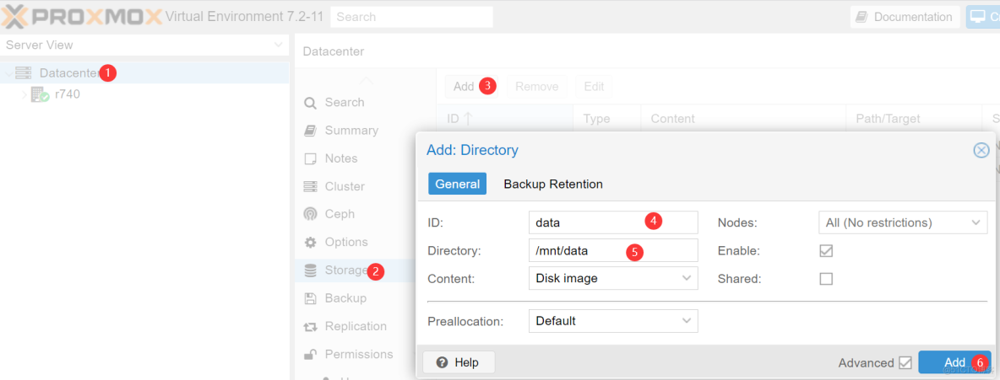

# Proxmox的local-lvm改文件存储，提升运行速度
## 介绍
Proxmox的缺省安装会创建 local 和 local-lvm 两个存储。其中local大约磁盘容量的10%，存储类别为目录。 local-lvm的存储类别为 lvm-thin。

实际使用中，发现大批量创建虚拟机时，lvm-thin的效率比目录的效率低，影响系统的IO性能。 主要的原因应该是 lvm-thin 模式下，缺少了文件层的缓存机制。影响了IO效率。

比如双路服务器，使用960G SSD企业硬盘做为存储，如果采用lvm-thin机制，使用 DoraCloud桌面云创建50个桌面，需要超过10分钟。如果采用目录存储，创建速度会提升不少。

有些Proxmox 用户喜欢删除 local-lvm，把所有的磁盘空间都分配给 local 。不推荐这样配置。 因为 local 存储上有proxmox的系统文件。如果虚拟机的磁盘也保存在local上，如果遇到磁盘空间耗尽的情况，可能导致 proxmox 的系统也无法启动。 影响系统稳定性，给生产环境的长期运行带来隐患。

本文主要介绍如何将缺省安装的 local-lvm 存储改成 目录机制。描述了分解步骤。以及对应的脚本。 最后汇总成一个脚本搞定（复制&粘贴）。 一键搞定是本博主的风格。

## 操作步骤

### 第一步：从Proxmox Web界面，删除 local-lvm

登录 PVE web界面，在 数据中心->存储中，选择 local-lvm，然后点击删除。


```
pvesh delete  /storage/local-lvm
```
### 第二步：通过命令删除 lvm，新建lvm，并创建文件系统

1、登录 Proxmox的 ssh。

2、卸载并删除 lvm-thin
```
umount /dev/pve/data
lvremove /dev/pve/data
按Y 确认删除。
```
3、检查磁盘剩余空间
```
vgdisplay pve | grep Free
```
4、创建新的lvm

注意，请使用上一步的空闲空间的数字92482替换下面的数字。
```
lvcreate -l 92482 -n data pve
```
5、格式化，并挂载文件系统。
```
mkfs.ext4 /dev/pve/data
mkdir /mnt/data
mount /dev/pve/data /mnt/data
```
6、最后配置 fstab，确保重启时，可以挂载文件系统
```
nano /etc/fstab/dev/pve/data /mnt/data ext4 defaults 0 0
``` 
上述步骤 1-7，可以通过一个复制张贴如下命令，自动完成。 请确保在新安装的，没有数据的 Proxmox 主机上执行。
```
umount /dev/pve/data
lvremove /dev/pve/data -y
vgdisplay pve | grep Free | awk '{print "lvcreate -l " $5 " -n data pve -y"}' |bash
mkfs.ext4 /dev/pve/data
mkdir /mnt/data
mount /dev/pve/data /mnt/data
echo "/dev/pve/data /mnt/data ext4 defaults 0 0" >> /etc/fstab
```
### 第三步：在Proxmox 将注册目录为存储

在Proxmox后台，选择 DataCenter->存储->添加， ID填写 data， 目录填写 /mnt/data。 即可添加名为  Data 的存储。


```
pvesm  add dir  data  --path=/mnt/data
 ```
 所有的操作汇总成如下脚本
```
pvesh delete /storage/local-lvm
umount /dev/pve/data
lvremove /dev/pve/data -y
vgdisplay pve | grep Free | awk '{print "lvcreate -l " $5 " -n data pve -y"}' |bash
mkfs.ext4 /dev/pve/data
mkdir /mnt/data
mount /dev/pve/data /mnt/data
echo "/dev/pve/data /mnt/data ext4 defaults 0 0" >> /etc/fstab
pvesm  add dir  data  --path=/mnt/data
```

>原文链接：https://blog.51cto.com/jieyun/9611770
